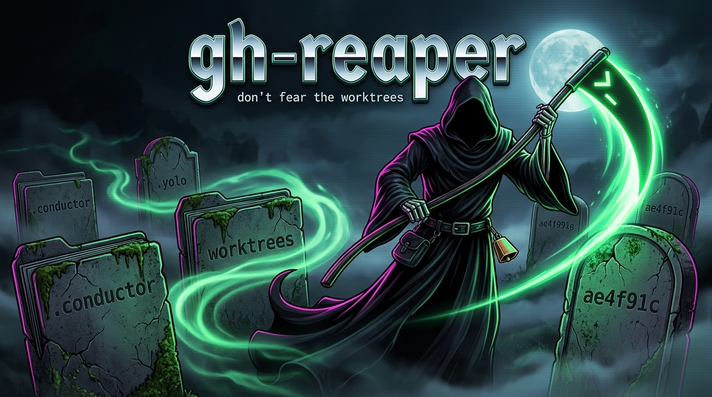

# gh-reaper

[](https://github.com/ai-ecoverse/vibe-coded-badge-action)



> _"Seasons don't fear the reaper / Nor do the wind, the sun, or the rain..."_
> — and neither do the dozen git worktrees you spun up six months ago and forgot about.

**`gh reaper`** is a [GitHub CLI](https://cli.github.com/) extension that hunts down stale **git worktrees** across your machine and tells you how long each has been gathering dust and how much disk it's hoarding. It's **read-only by default** — it just shows you the graveyard. Add `--reap` when you're ready to actually delete.

```
AGE      SIZE  STATUS    BRANCH                 PATH
8mo    160.7M  clean     opencode-blog-archive  ~/Developer/helix-website/.conductor/opencode-blog-archive
7mo    116.1M  dirty     submit-to-zed-registry ~/Developer/zed-elvish/.conductor/islamabad
7mo      6.0M  orphan    ?                      ~/Developer/tree-sitter-fountain-forced-scene-headings
6mo      544K  clean     renovate/actions-check ~/Developer/aem-boilerplate/.yolo/claude-1
2h       2.8G  merged    migrate-vfs-to-opfs    ~/intent/workspaces/restricted-implement/slicc
```

(That last one was touched two hours ago, so age alone would never flag it — but its branch is already merged, so it's safe to reap. That's the `merged` signal earning its keep.)

Worktrees are wonderful — until you have forty of them. Tools like [Conductor](https://conductor.build), `git worktree add`, and various AI agents scatter checkouts all over your disk, and `git worktree prune` only cleans up the ones whose directories are *already gone*. `gh reaper` finds the living-but-forgotten ones.

## Features

- **Machine-wide discovery** — sweeps your usual code roots (`~/Developer`, `~/conductor`, `~/intent/workspaces`, `~/.codex/worktrees`, `~/Projects`, `~/go/src`, …) for linked worktrees, not just the repo you're standing in. Knows where agent tools (Conductor, yolo, intent, Codex) stash their checkouts — and finds Claude Code's `<repo>/.claude/worktrees/` automatically since they nest inside scanned repos.
- **Age & size at a glance** — every worktree shows when it was last touched and how much disk it occupies, sorted oldest-first. "Touched" means the newest **non-gitignored** change, so a routine `npm install` or build doesn't make a months-old worktree look brand new.
- **Knows what's already done** — flags worktrees whose `HEAD` is already merged into the default branch (`merged`), and optionally asks `gh` whether a branch's PR was squash-merged (`pr-merged`, via `--check-prs`). Sweep just the finished ones with `gh reaper --merged --reap`.
- **Safety classification** — each worktree is tagged `merged`, `clean`, `dirty`, `unpushed`, or `orphan`. Risky ones are never reaped without `--force`.
- **macOS-friendly** — scans a curated set of dev directories by default, so it's fast and **never trips macOS privacy (TCC) permission prompts** for Desktop, Documents, Downloads, Photos, and friends.
- **Reaps the right way** — uses `git worktree remove` (run from the main worktree) so git's bookkeeping stays consistent; `--prune` tidies the admin entries afterward.
- **Read-only by default** — bare `gh reaper` only lists; nothing is deleted until you pass `--reap`. Then confirm each one, `[a]ll` at once, or add `--yes` to sweep unattended. `--json` for the scripty.

## Installation

```bash
gh extension install ai-ecoverse/gh-reaper
```

Upgrade later with:

```bash
gh extension upgrade reaper
```

**Requirements:** `git`, plus the usual POSIX suspects (`find`, `du`, `stat`, `awk`). `jq` is only needed for `--json`. Works on macOS (BSD tools) and Linux (GNU tools).

## Usage

```bash
# Survey forgotten worktrees -- read-only, the default
gh reaper

# Only the truly stale: untouched 30+ days and bigger than 100 MB
gh reaper --min-age 30 --min-size 100

# Sweep only worktrees whose work is already merged (incl. squashed PRs)
gh reaper --merged --check-prs --reap

# Scan a specific spot, then reap interactively
gh reaper ~/work/monorepo --reap

# Reap everything 2+ weeks old, no prompts
gh reaper --min-age 14 --reap --yes

# Machine-wide survey (still skips TCC-protected dirs)
gh reaper --all

# Pipe the inventory into your own tooling
gh reaper --json | jq '.[] | select(.sizeKb > 100000) | .path'
```

### Options

```
gh reaper [OPTIONS] [PATH...]

  -r, --reap           Delete worktrees (interactive unless --yes). Without this,
                       gh reaper only lists -- it never removes anything.
  -d, --min-age DAYS   Only show worktrees untouched for at least DAYS (default: 0)
  -s, --min-size MB    Only show worktrees at least MB megabytes in size (default: 0)
  -m, --merged         Only show worktrees whose HEAD is merged into the default
                       branch (with --reap, sweep exactly the done ones)
      --check-prs      For non-merged branches, ask 'gh' whether their PR was
                       merged (catches squash-merges; needs gh auth + network)
  -p, --path DIR       Add a scan root (repeatable; also accepted as PATH args)
  -j, --jobs N         Parallel inspection workers (default: CPU count; 1 = serial)
  -a, --all            Scan all of $HOME (still skips TCC-protected dirs)
  -y, --yes            With --reap, delete without prompting for each worktree
  -f, --force          With --reap, also remove dirty, unpushed, or orphaned worktrees
      --prune          With --reap, run 'git worktree prune' on touched repos afterward
      --json           Emit results as JSON (always read-only)
      --dry-run        List only, change nothing (this is the default; kept for habit)
      --no-color       Disable colored output
  -v, --version        Show version
  -h, --help           Show this help
```

### Status flags

| Status      | Meaning                                                        | Reaped on `--reap`? |
| ----------- | ------------------------------------------------------------- | ------------------- |
| `merged`    | HEAD is already in the default branch — the work is done       | ✅ yes               |
| `pr-merged` | The branch's PR was merged (squash/rebase); `--check-prs` only | ✅ yes               |
| `clean`     | No local changes; HEAD exists on a remote — safe to delete     | ✅ yes               |
| `dirty`     | Uncommitted or untracked changes present                       | 🔒 needs `--force`  |
| `unpushed`  | Commits that exist nowhere on a remote (would be lost)         | 🔒 needs `--force`  |
| `orphan`    | The main repository is gone; only the lonely checkout remains  | 🔒 needs `--force`  |

A worktree can combine flags — e.g. `dirty merged` means the commits are merged but
there are still uncommitted edits, so it needs `--force`. `merged`/`pr-merged`
supersede the `unpushed` warning, since those commits are accounted for upstream.

## How it works

**Discovery.** A linked worktree is marked by a `.git` *file* (not a directory) whose contents point into `…/worktrees/…`. `gh reaper` finds those with a single pruned `find` per root, skipping `node_modules`, caches, `Library`, `*.noindex`, and the like — and skipping submodules (whose `.git` files point into `…/modules/…`).

**Scan roots.** By default it only walks well-known developer directories that actually exist on your machine, plus your current directory. This keeps it fast and, on macOS, keeps it clear of the TCC-protected folders (Desktop, Documents, Downloads, Pictures, Movies, Music, `Library`, iCloud Drive, external `/Volumes`) that would otherwise pop a permission dialog. `--all` opts into a full `$HOME` sweep but **still** hard-skips those protected locations. Point it anywhere explicitly with a `PATH` argument or `--path`.

**Speed.** The slow part of a scan is sizing (`du`) and classifying (`git`) each worktree, so those run in parallel across workers (default: your CPU count). On a real 238-worktree / 114 GB machine this cut a scan from ~121s to ~31s. Tune with `--jobs N`, or `--jobs 1` to force serial. Results are identical either way.

**"Last touched."** Age is the newest **non-gitignored** change: the most recent mtime among tracked and untracked-but-not-ignored files (`git ls-files`), combined with the last commit date. Build output, `node_modules`, caches and other gitignored churn are excluded — so a routine `npm install`, build, or automated `git checkout` no longer resets a worktree's apparent age. (Earlier versions used the working-directory and reflog mtimes, which a single install or sync could bump, making months-stale worktrees look brand new.) Orphans, where git can't enumerate the tree, fall back to the working-dir / reflog mtime.

**Merged detection.** Beyond age, each worktree is checked for whether its work is already done. The offline check is `git merge-base --is-ancestor HEAD <default-branch>` — if true, every commit is already in the default branch, so the worktree is tagged `merged` regardless of how recently its files were touched. GitHub's "Squash & merge" rewrites history, so a merged branch may not be an ancestor; `--check-prs` covers that by asking `gh pr list --state merged` per unconfirmed branch (networked, opt-in) and tagging matches `pr-merged`. Either way, merged work is safe to reap without `--force` (unless the working tree is also dirty).

**Reaping** happens only under `--reap` — bare `gh reaper` is a read-only listing. Clean worktrees are removed with `git worktree remove` executed from the *main* worktree (so git won't refuse to remove "the current working tree"). Dirty/unpushed worktrees get `--force` only when you pass `--force`. True orphans — whose main repo is gone, so git can't help — are removed with `rm -rf`, and also only under `--force`.

## Safety

- **Read-only by default.** Nothing is ever removed unless you pass `--reap`; `--dry-run` and `--json` are always read-only, and `--yes`/`--force` do nothing on their own.
- `dirty`, `unpushed`, and `orphan` worktrees are **skipped unless `--force`** — your uncommitted edits and unpushed commits are safe by default.
- With `--reap`, interactive mode asks per worktree (`[y]es / [n]o / [a]ll / [q]uit`); add `--yes` to skip the prompts.
- It only ever targets linked worktrees — it will never offer to delete a main repository.

> _More cowbell strongly recommended but not required._

## Uninstall

```bash
gh extension remove reaper
```

## License

[Apache-2.0](LICENSE) © the AI Ecoverse contributors.
